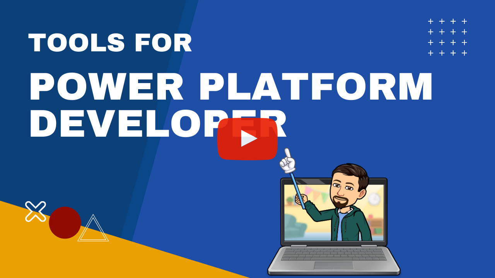

# Episode - 02

In this episode we will look at all the tools we need as a Power Platform Developer. We will understand the download process for some of them. We will also learn the basics of those tools.

****

## Dataverse SDK

Download Link: https://xrm.tools/SDK

It contains 4 tools namely:

- **Configuration Migration**: This helps in moving the configuration data from one environment to another. This has been explained in the video as well. Direct link [here](https://youtu.be/1NrfmDuF9Ec?t=202).
- **Core Tools**: This contains the CrmSvcUtil that helps you generate early-bound classes.
- **Package Deployment**: Using this tool you can pack the CRM solution that can be used to create ISV solutions.
- **Plugin Registration Tool**: Helps you with managing back-end code assemblies and event registrations.

## Power Platform Tools for Visual Studio 2019

Instructions Link:  https://docs.microsoft.com/en-us/powerapps/developer/data-platform/tools/devtools-install?WT.mc_id=BA-MVP-5003877

## XrmToolBox

Download Link: https://www.xrmtoolbox.com/

For connecting to Dataverse using Connection String you can read the [guide here](https://docs.microsoft.com/en-us/previous-versions/dynamicscrm-2016/developers-guide/mt608573(v=crm.8)?WT.mc_id=BA-MVP-5003877).

## Level Up

Download Link: https://chrome.google.com/webstore/detail/level-up-for-dynamics-365/bjnkkhimoaclnddigpphpgkfgeggokam

## Tools for VS Code

Most of the tools are package in the extension pack that you can [download here](https://marketplace.visualstudio.com/items?itemName=danish-naglekar.power-platform-extension-pack).

## Postman

To setup Dataverse environment in Postman refer to [this guide](https://docs.microsoft.com/en-us/powerapps/developer/data-platform/webapi/setup-postman-environment?WT.mc_id=BA-MVP-5003877).