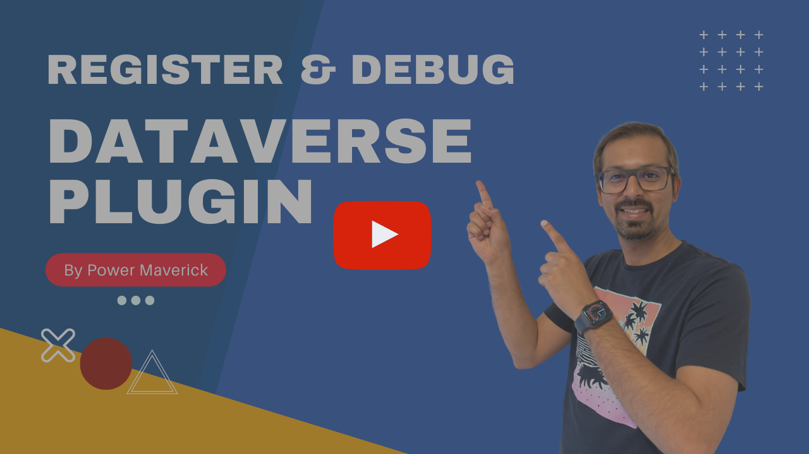

# Episode - 04 & 05

In this episode, we will look at setting up a plugin project, writing a simple plugin, registering it in Dataverse, debugging the plugin on local machine and finally adding some tracing. 

[Link to Jonas Rapp's Canary Tracer](https://github.com/rappen/RappCanary365/blob/master/Plugin/CanaryTracer.cs)

### 04

****

### 05

****
